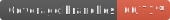
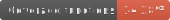
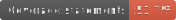

<!-- @format -->

# React Weather Component

> Display weather for current location.





[](https://lerna.js.org/)

[](https://www.npmjs.com/react-weather-component)
[](https://github.com/MarkRabey/react-weather-component/blob/master/LICENSE)

## Version 1.0.0 is coming! 🎉

I've started initial work on version 1.0.0! Why v1? Because it will be a full re-write! The plan is to:

- port the code to TypeScript
- adding loads of styling options
- better documentation
- unit tests, and,
- eventually, I hope to add React Native support

## Version < 1.0.0

### IMPORTANT!

GitHub serves all GitHub Pages content via `https`, however, the OpenWeatherMap API does not currently function on `https`. Therefore, the demo pages aren't working correctly. I'm working to resolve this (possibly with another API provider).

To test outside of GitHub Pages, clone the repo, run `npm install && npm start` and visit http://localhost:8080.

### Install

```shell
npm install react-weather-component --save
```

### Live Demo

- <a href="//markrabey.github.io/react-weather-component" target="_blank">Basic Example</a>

### Usage

Enter usage details here.

### License

[MIT](http://mit-license.org) Copyright (c) 2017, 2022 Mark Rabey <mark@markrabey.com>
